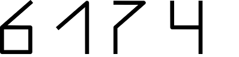

<div id="top"></div>

[![Contributors][contributors-shield]][contributors-url]
[![Forks][forks-shield]][forks-url]
[![Stargazers][stars-shield]][stars-url]
[![Issues][issues-shield]][issues-url]
[![MIT License][license-shield]][license-url]
[![LinkedIn][linkedin-shield]][linkedin-url]

<!-- PROJECT LOGO -->
<br />
<div align="center">
  <a href="https://github.com/Magician6174/Why_6174">
    
  </a>

<h3 align="center">Why 6174?</h3>

  <p align="center">
    Number 6174!!
    <br />
    <a href="https://github.com/Magician6174/Why_6174"><strong>Explore the docs »</strong></a>
    <br />
    <br />
    <a href="https://github.com/Magician6174/Why_6174">View Demo</a>
    ·
    <a href="https://github.com/Magician6174/Why_6174/issues">Report Bug</a>
    ·
    <a href="https://github.com/Magician6174/Why_6174/issues">Request Feature</a>
  </p>
</div>

> Kaprekar's constant 6174.

> Kaprekar's constant


<!-- TABLE OF CONTENTS -->
<details>
  <summary>Table of Contents</summary>
  <ol>
    <li>
      <a href="#about-the-project">About The Project</a>
      <ul>
        <li><a href="#built-with">Built With</a></li>
      </ul>
    </li>
    <li>
      <a href="#getting-started">Getting Started</a>
    <li><a href="#contributing">Contributing</a></li>
    <li><a href="#license">License</a></li>
    <li><a href="#contact">Contact</a></li>
    <li><a href="#acknowledgments">Acknowledgments</a></li>
  </ol>
</details>

<!-- ABOUT THE PROJECT -->
## About The Project
6174 is known as Kaprekar's constant after the Indian mathematician D. R. Kaprekar. This number is notable for the following rule:

  1. Take any four-digit number, using at least two different digits (leading zeros are allowed).
  2. Arrange the digits in descending and then in ascending order to get two four-digit numbers, adding leading zeros if necessary.
  3. Subtract the smaller number from the bigger number.
  4.  Go back to step 2 and repeat.

The above process, known as Kaprekar's routine, will always reach its fixed point, 6174, in at most 7 iterations.  Once 6174 is reached, the process will continue yielding 7641 – 1467 = 6174.

Some Other Interesting Properties - 

- 6174 is a Harshad number, since it is divisible by the sum of its digits.
- 6174 is a 7-smooth number, i.e. none of its prime factors are greater than 7.
- 6174 can be written as the sum of the first three degrees of 18:

    
    
- The sum of squares of the prime factors of 6174 is a square:

    

### Built With
This project was built with 

* python 3.8.10


<!-- GETTING STARTED -->
## Getting Started

This is an example of how you may give instructions on setting up your project locally.
To get a local copy up and running follow these simple example steps.


Clone the repository into a local machine using
```shell
git clone https://github.com/Magician6174/Why_6174.git
```

- Run this to check for your favourite 4 digit number.
  ```sh
  python why_6174.py

- Run this file to get list of all invalid 4 digit numbers.
  ```sh
  python show_incorrect_numbers.py

<!-- CONTRIBUTING -->
## Contributing

Contributions are what make the open source community such an amazing place to learn, inspire, and create. Any contributions you make are **greatly appreciated**.

If you have a suggestion that would make this better, please fork the repo and create a pull request. You can also simply open an issue with the tag "enhancement".
Don't forget to give the project a star! Thanks again!

1. Fork the Project
2. Create your Feature Branch (`git checkout -b feature/AmazingFeature`)
3. Commit your Changes (`git commit -m 'Add some AmazingFeature'`)
4. Push to the Branch (`git push origin feature/AmazingFeature`)
5. Open a Pull Request

<!-- LICENSE -->
## License

Distributed under the MIT License. See `LICENSE` for more information.

<!-- CONTACT -->
## Contact

Magician6174 - [My Email](mailto:himanshumagician@gmail.com "himanshumagician@gmail.com")

Project Link: [Why_6174](https://github.com/Magician6174/Why_6174)

<!-- ACKNOWLEDGMENTS -->
## Acknowledgments

* [Wikipedia](https://en.wikipedia.org/wiki/6174_(number))
* [Numberphile](https://www.youtube.com/watch?v=d8TRcZklX_Q)

 
<p align="right">(<a href="#top">back to top</a>)</p>

[contributors-shield]: https://img.shields.io/github/contributors/Magician6174/Why_6174.svg?label=CONTRIBUTORS&logo=github&style=flat-square
[contributors-url]: https://github.com/Magician6174/Why_6174/graphs/contributors
[forks-shield]: https://img.shields.io/github/forks/Magician6174/Why_6174?.svglabel=FORKS&logo=GITHUB&style=flat-square
[forks-url]: https://github.com/Magician6174/Why_6174/network/members
[stars-shield]: https://img.shields.io/github/stars/Magician6174/Why_6174.svg?label=STARS&logo=github&style=flat-square
[stars-url]: https://github.com/Magician6174/Why_6174/stargazers
[issues-shield]: https://img.shields.io/github/issues/Magician6174/Why_6174.svg?label=ISSUES&logo=GITHUB&style=flat-square
[issues-url]: https://github.com/Magician6174/Why_6174/issues
[license-shield]: https://img.shields.io/github/license/Magician6174/Why_6174.svg?label=LICENSE&logo=github
[license-url]: https://github.com/Magician6174/Why_6174/blob/master/LICENSE
[linkedin-shield]: https://img.shields.io/badge/-LinkedIn-black?style=flat-square&logo=linkedin&colorB=555
[linkedin-url]: https://www.linkedin.com/in/himanshu-sharma-39689b205/
[product-screenshot]: images/screenshot.png
